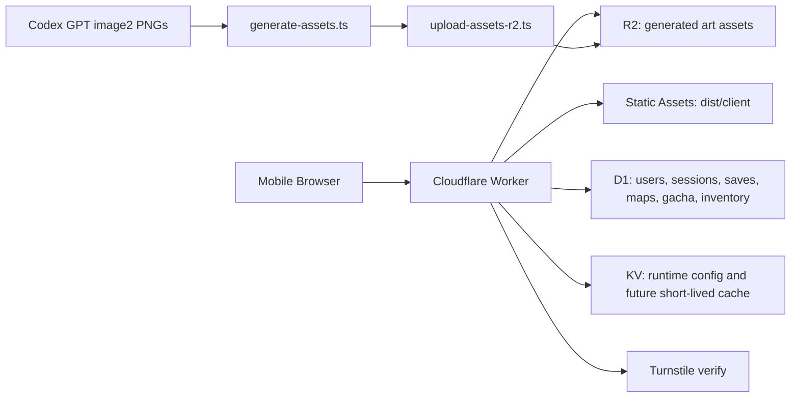

# Technical Design

## Architecture

破産防衛都市は Cloudflare Workers Static Assets 上で配信する SPA です。静的ファイルは `dist/client/` から配信し、`/api/*` だけ Worker script を先に通します。

## Source Boundaries

- `src/**`: React UI、ゲーム、Worker API。他担当が編集。
- `docs/**`: 仕様、設計、運用。この担当が編集。
- `scripts/generate-assets.ts`: Codex GPT image2 local import / placeholder asset generation。
- `scripts/upload-assets-r2.ts`: local asset upload helper。
- `wrangler.jsonc`: Cloudflare binding contract。

## Worker Entry

標準 entrypoint は `src/worker/index.ts` です。React UI と Worker API の衝突を避けるため、API 実装は `src/worker/**` に寄せます。

`wrangler.jsonc`:

- `main`: `src/worker/index.ts`
- `assets.directory`: `./dist/client`
- `assets.not_found_handling`: `single-page-application`
- `assets.run_worker_first`: `["/api/*"]`

## API Contract

PR1 で実装済みの API:

- `GET /api/health`
- `POST /api/auth/signup`
- `POST /api/auth/login`
- `POST /api/auth/logout`
- `GET /api/auth/me`
- `GET /api/profile`
- `PATCH /api/profile`
- `GET /api/saves`
- `GET /api/saves/:id`
- `POST /api/saves`
- `PUT /api/saves/:id`
- `DELETE /api/saves/:id`
- `POST /api/maps/generate`
- `GET /api/maps`
- `GET /api/maps/:id`
- `GET /api/gacha/banners`
- `GET /api/gacha/banners/:id/rates`
- `POST /api/gacha/roll`
- `GET /api/gacha/history`
- `GET /api/inventory`
- `GET /api/cards/definitions`
- `GET /api/assets/:key`
- `GET /api/assets`

## Data Model

### Users And Profiles

- `id`
- `email`
- `username`
- `password_hash`
- `created_at`
- `updated_at`

`user_profiles` は `soft_currency`、`gacha_currency`、`last_login_at` を持つ。

### Game State

- `user_id`
- `slot`
- `name`
- `map_id`
- `game_version`
- `day`
- `state_json`
- `updated_at`

### Generated Map

- `id`
- `user_id`
- `seed`
- `name`
- `width`
- `height`
- `difficulty`
- `params_json`
- `preview_json`
- `created_at`

### Gacha Draw

- `id`
- `user_id`
- `banner_id`
- `roll_type`
- `result_json`
- `cost`
- `created_at`

`gacha_pity` が SR / UR 天井カウンターを保持し、`inventory_items` がカード所持数を保持する。

### Asset Manifest

- `id`
- `kind`
- `public_path`
- `r2_key`
- `prompt_hash`
- `source`
- `created_at`

## Guest To Login Flow

ゲスト状態は端末内 storage で進みます。ログイン後も同じ React/Zustand のゲーム状態を維持するため、次のセーブ操作から D1 `game_saves` に保存されます。

ルール:

- 未ログイン時は API failure を UI 側で local fallback し、プレイを止めない。
- ログイン済みのセーブ、マップ生成、ガチャは Cookie セッションで D1 に保存する。
- 将来の自動 merge は、`state_json` version と `inventory_items` の数量加算を単位に実装する。

## Abuse Controls

- Turnstile: login、free gacha、短時間での state save 連打。
- D1 rate limit: `rate_limits` table に IP hash / route / window を保存。
- Gacha idempotency: `gacha_rolls.idempotency_key`。
- Server-side draw: client に seed 決定権を渡さない。

## Asset Pipeline

1. `docs/art-prompts.md` の prompt を asset request として扱う。
2. `scripts/generate-assets.ts` が `generated/manifest.json` を生成。
3. `generated/codex-image2-source/<slug>.png` があれば Codex GPT image2 asset として取り込む。
4. PNG がなければ SVG / PNG placeholder を生成。
5. `public/assets/generated/` に公開用コピーを置く。
6. 必要に応じて `scripts/upload-assets-r2.ts` で R2 へ送る。
7. Worker API が manifest を読み、React UI と map generator が同じ public path を参照する。

## Environment Variables

Secrets:

- `TURNSTILE_SECRET_KEY`
- `SESSION_SECRET`
- `RATE_LIMIT_SALT`

Public / non-secret:

- `APP_ENV`
- `PUBLIC_APP_ORIGIN`
- `TURNSTILE_SITE_KEY`
- `CODEX_IMAGE_MODEL`
- `ASSET_PUBLIC_BASE`
- `FREE_GACHA_DAILY_LIMIT`

## Testing Strategy

- Script unit-level: strict TypeScript compile。
- Asset smoke: Codex GPT image2 source なしで placeholder generation。
- Cloudflare config: `wrangler deploy --dry-run` once Worker entry exists。
- API: service tests and Cloudflare local smoke with D1。
- UI: mobile viewport Playwright smoke。

## PR1 Complete State

- ゲストプレイ、ログイン同期、D1 永続化が通る。
- 無料通貨ガチャ、履歴、Turnstile gate が通る。
- 都市マップ生成とスマホ UI が asset manifest を参照する。
- Codex GPT image2 source なしで `generated/` と `public/assets/generated/` が埋まる。
- R2 upload は dry-run でキー一覧を確認できる。
- `wrangler.jsonc` に D1 / R2 / KV / Static Assets / Turnstile placeholders がある。

## Remaining Work

- 本番 D1 / R2 / KV / Turnstile ID の差し替え。
- production smoke URL の確定。
- ガチャ、報酬、都市 pressure の数値バランス調整。
- 追加アートの生成と品質レビュー。
